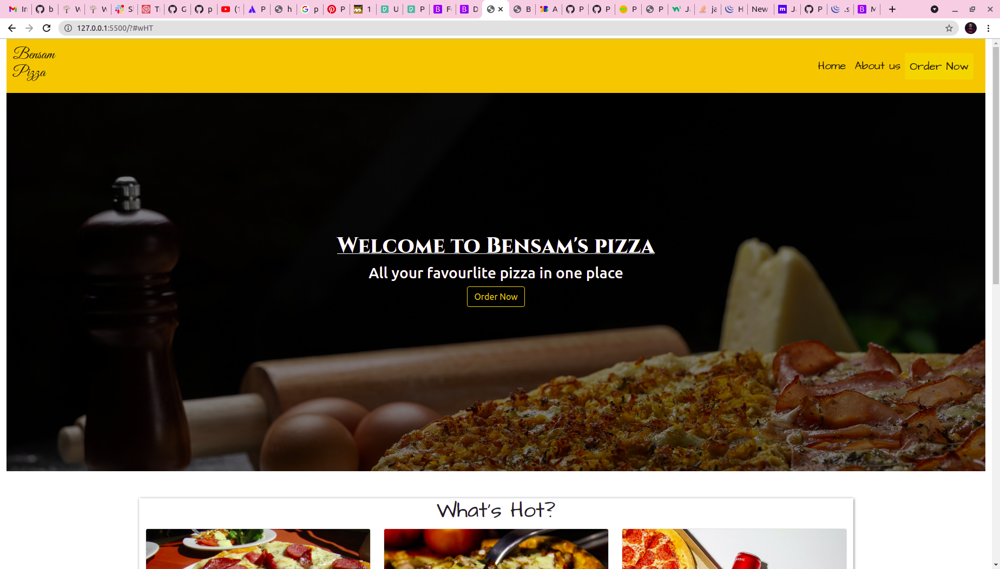

# {Bensam Pizza}
#### {show the the progress in jquery and javascript}, {version 08.02.2021}
#### By **{Bensam mwaniki}**
## Description
{Bens pizza place is a web that help users order pizza online ata their own comfort}
## Setup/Installation Requirements
* no set up require
* but one is recomended to use chrome while viewing the app
* no signin required
* ensure u are using latest version of chrome since the app uses html5 
## screenshot

## Known Bugs
{the app does not have a back end so it does not store user data }
## Technologies Used
{ 
html5
css3
jquery
javascript
boostrap5}
## Support and contact details
{for more info about the app and contribution email benson.mwaniki@student.moringaschool.com.
Bensam Mwaniki}
{to view the app click on this link -> }
### License
*{mit licence.  See below for more details on licensing.}*
Copyright (c) {2021} **{melenial agency}**
